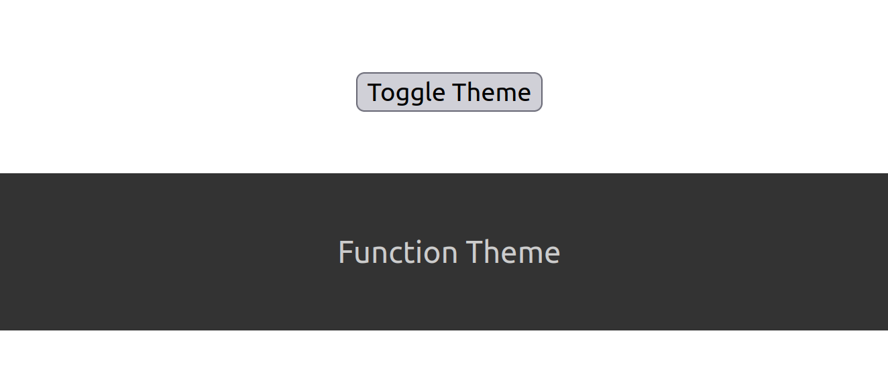
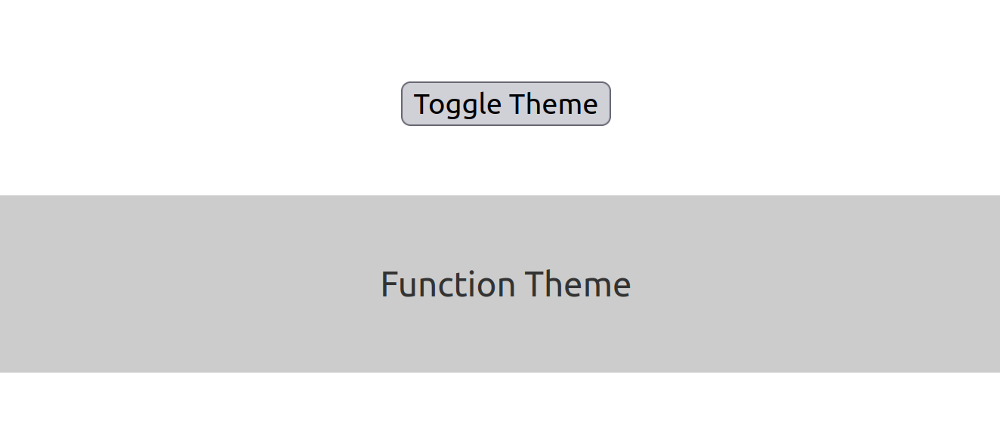

# React useContext Hook

useContext is a React Hook that lets you read and subscribe to context from your component.
const value = useContext(SomeContext)

React Context is a way to manage state globally.
It can be used together with the useState Hook to share state between deeply nested components more easily than with useState alone.

Context in React provides a way to pass data through a component tree without the need to prop-drill (i.e., pass props down manually at every level).

## Props vs Context:
- Props is best used when data needs to be isolated to a few set of components only.
- Context is best used for application-wide client data. Things like theme information, locale/language preferences, user authentication information, etc. are best kept in Context since any component within an application may have the need to access this data at any time.

## How does it look?

 

