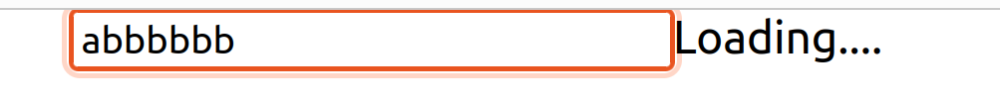
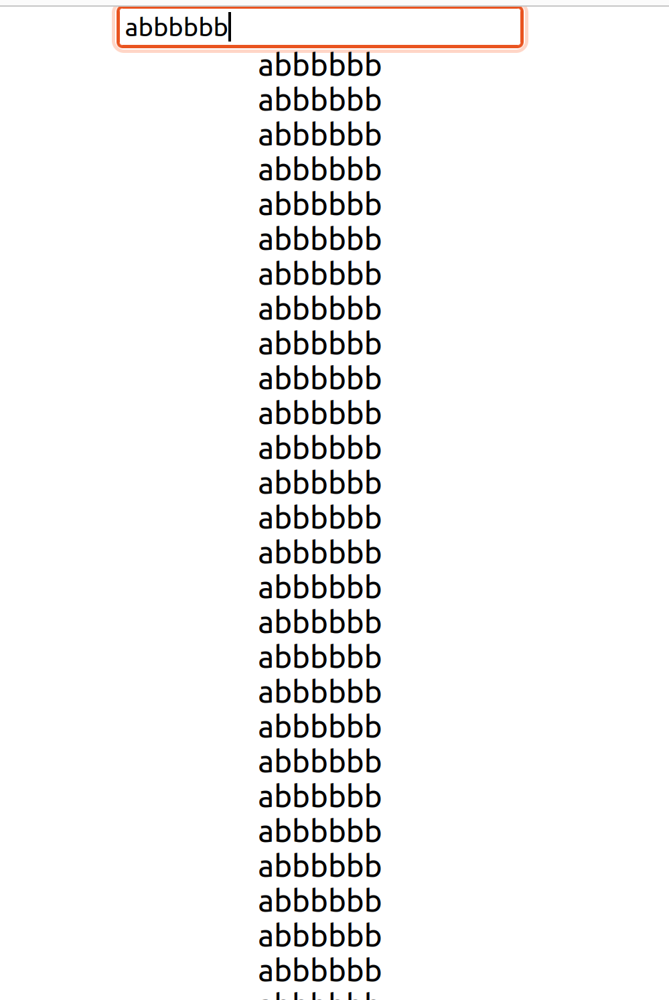

# React useTransition Hook

useTransition is a React Hook that lets you update the state without blocking the UI.
const [isPending, startTransition] = useTransition()

The isPending flag that tells you whether there is a pending transition.
The startTransition function that lets you mark a state update as a transition.

## Usage
- Marking a state update as a non-blocking transition 
- Updating the parent component in a transition 
- Displaying a pending visual state during the transition 

## How does it look?

