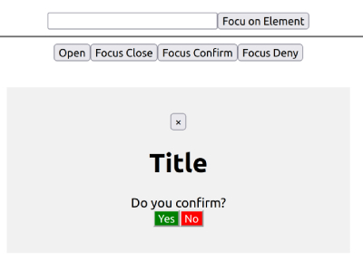

# React useImperativeHandle Hook

useImperativeHandle is a React Hook that lets you customize the handle exposed as a ref.
useImperativeHandle(ref, createHandle, dependencies?)

The useImperativeHandle hook is a React hook that allows you to customize the instance value that is exposed by a parent component when using ref. It's useful when you want to provide a specific set of functions or properties to the parent component to interact with the child component's internal logic.

The useImperativeHandle hook is one of the lesser used React hooks, but it serves a very important purpose when dealing with complex refs. In this video I go over 2 examples that explain how this hook works in both a simple and more complex real world example so you can truly master this hook. 

## Overview

